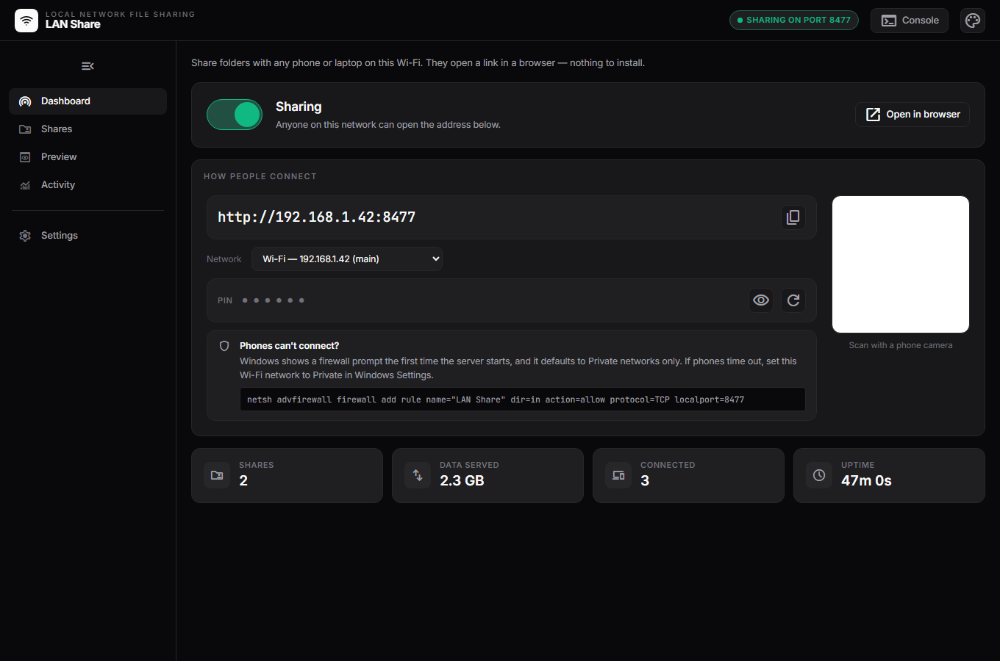
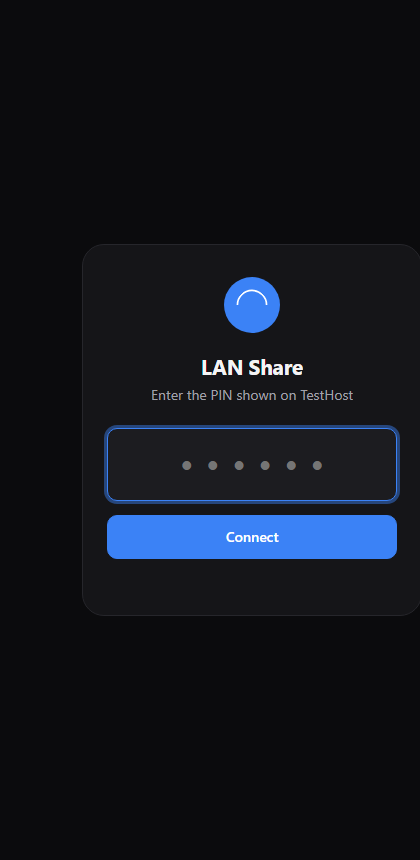
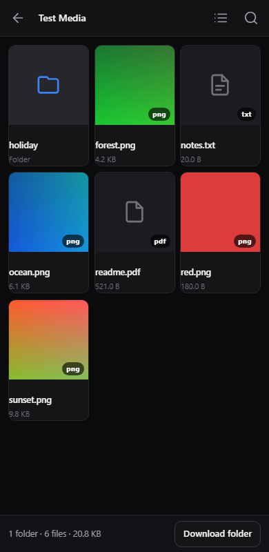
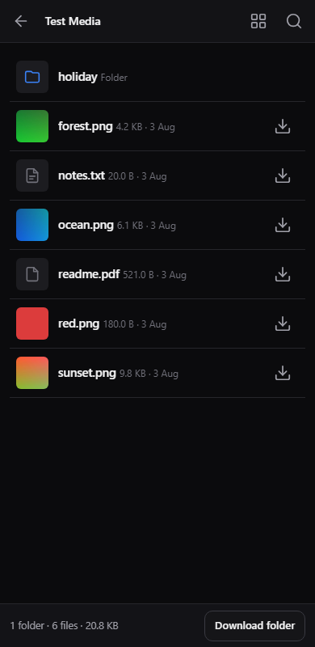
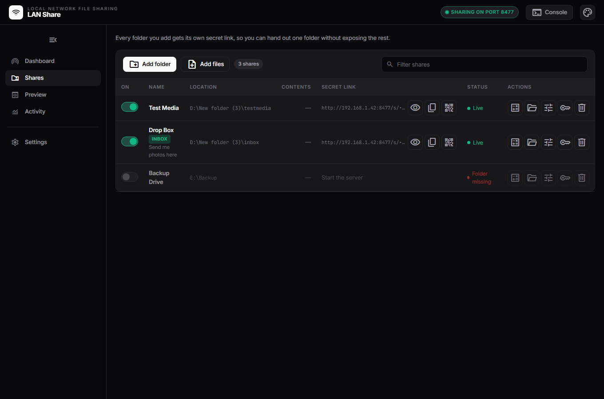
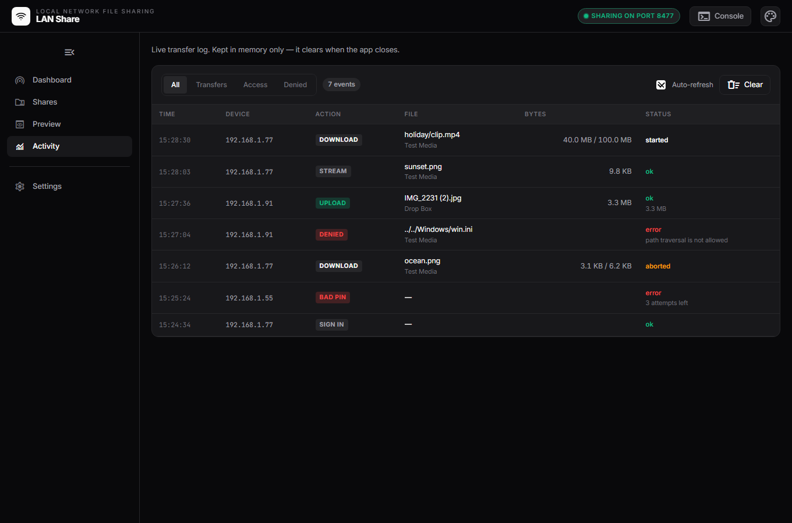
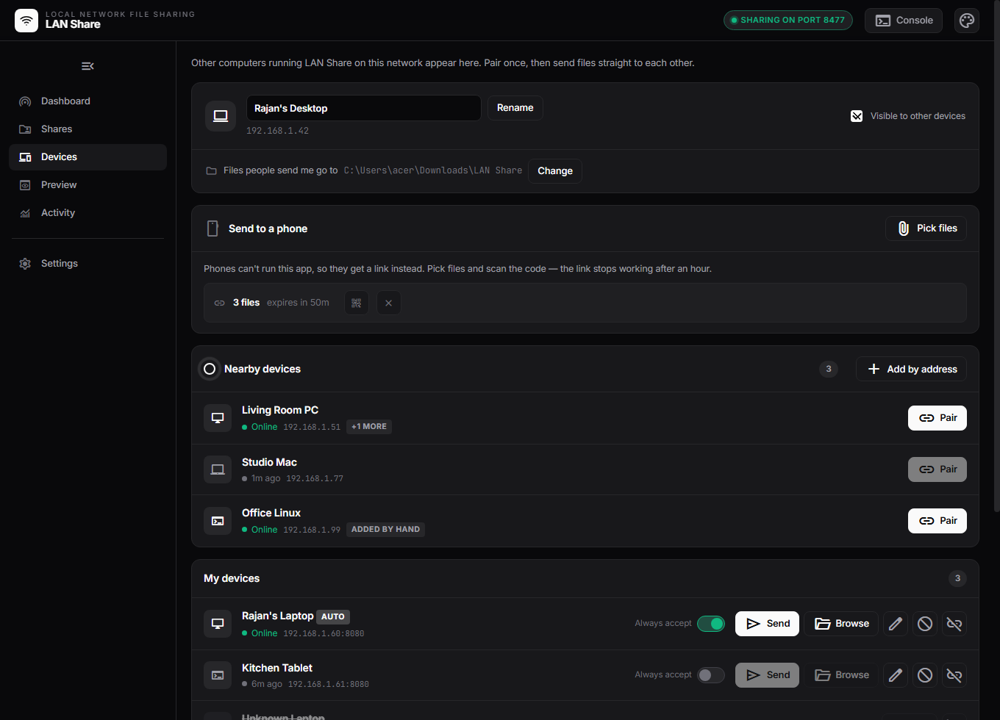
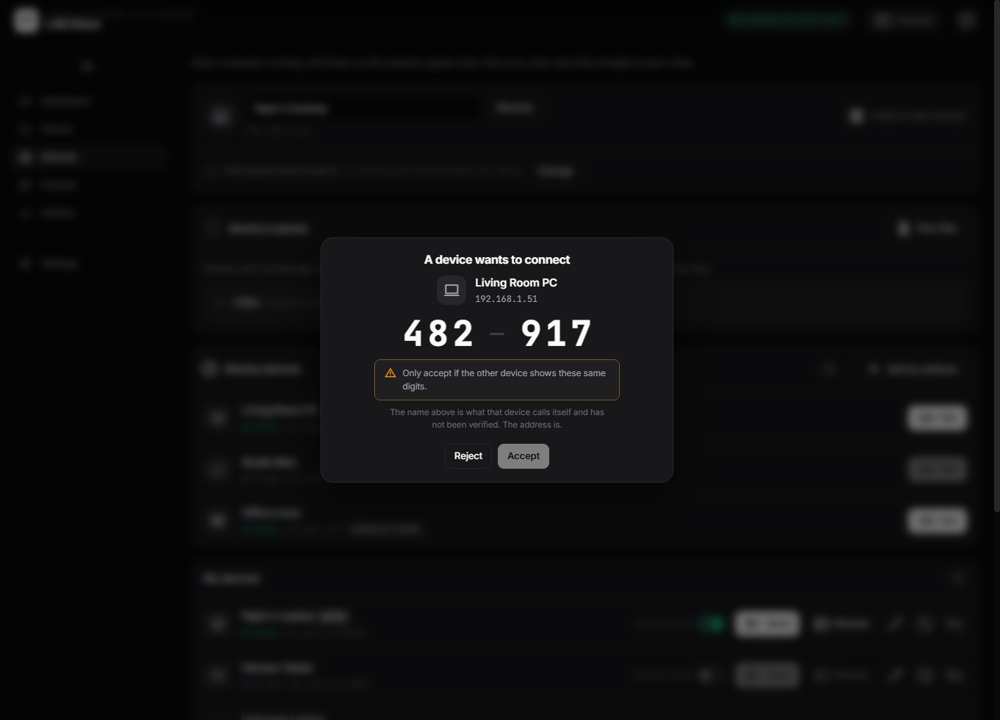
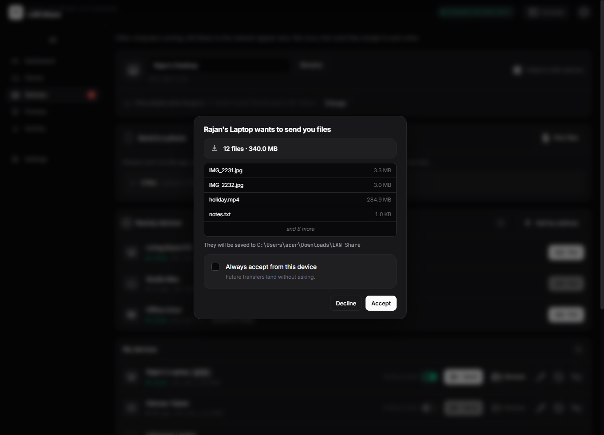

# LAN Share

Share folders and media over your local network. You pick folders in a desktop
app; anyone on the same Wi-Fi opens a link in their browser and browses,
streams or downloads the files. Nothing to install on their side.

Built with the same stack and conventions as the sibling `src-2` app: Rust +
Tauri v2, vanilla HTML/CSS/JS, **no bundler and no npm dependencies**.



## What it does

- **Find other devices on the network automatically**, the way Bluetooth lists
  nearby ones. Pair once per device; the list survives restarts.
- **One switch to go visible or hidden**, the same switch the server has. Hidden
  stops the beacon and nothing else: you still see everyone, and devices you
  have already paired with can still reach you.
- **Send files straight to a paired device**, and browse or pull from theirs.
- **Share folders or individual files.** Each share gets its own secret link, so
  you can hand out one folder without exposing the rest.
- **A 6-digit PIN** gates the whole server (toggleable). Wrong-PIN attempts are
  rate-limited per device.
- **Media gallery on the receiving end** — image thumbnails, inline video and
  audio playback with real seeking, an image lightbox, and a list-view toggle.
- **Per-file downloads**, plus an optional streamed `.zip` of a whole folder.
- **Optional upload inbox.** Off by default; when on, exactly one folder accepts
  uploads and nothing is ever overwritten.
- **Live activity log** showing who fetched what, how many bytes actually made it,
  and whether the transfer finished or died mid-stream.
- **QR code** so a phone joins by pointing its camera at the screen.

### Devices, in short

Two computers running LAN Share on one network see each other within about five
seconds. Click **Pair** on one; both then show the same six-digit code and you
tap **Accept** on the other. Nothing to type — and the matching code is what
stops a stranger on the same Wi-Fi from impersonating your laptop.

After that each can send files to the other (with an Accept prompt, or silently
if you flip *always accept* for that device) and browse the other's shares
without a PIN.

**Devices → the visibility switch** takes you off the network's radar without
stopping anything else. It is deliberately the same control as the server's
power switch, and it reads the same way: a title that says what is true now, a
pill that says whether anything is actually being announced.

**Phones can't be peers** — there is no desktop binary for them. They keep the
browser flow, and **Send to a phone** bridges the gap: pick files, and the app
mints a short-lived link plus a QR code the phone can scan.

## Running it

```sh
npm run tauri:dev      # cargo run --manifest-path src-tauri/Cargo.toml
npm run tauri:build    # release build
npm test               # cargo test  (163 tests)
```

There is no frontend build step — `ui/` is served straight from disk by Tauri,
and `src-tauri/web/` is compiled into the binary with `include_str!`.

### First run

1. **Shares** → *Add folder*.
2. **Dashboard** → flip the switch on.
3. Windows raises a firewall prompt. Tick **Private**, and also **Public** if
   you will use this on a café or hotel network.
4. Scan the QR code with a phone, or type the address in, then enter the PIN.

If a phone times out at step 4, the network is almost certainly classified
*Public* while the firewall rule is Private-only — Windows Settings → Network &
internet → Wi-Fi → *your network* → Private. You cannot reproduce this from the
host machine: connecting to your own LAN IP takes the loopback path and always
succeeds.

## Layout

```
ui/                        desktop control panel  (frontendDist, Tauri webview)
src-tauri/
  web/                     receiver web app       (include_str!'d into the exe)
  src/
    main.rs                Builder, command registry, RunEvent::Exit hook
    models.rs              AppState, AppConfig, every wire struct
    config.rs              JSON config load/save + derived-state rebuild
    server.rs              bind, runtime thread, router, graceful shutdown
    routes.rs              every axum handler
    auth.rs                PIN, sessions, share + pair tokens, the extractor
    shares.rs              path containment + directory listing
    media.rs               file-kind classification, thumbnails
    net.rs                 LAN address ranking, QR
    activity.rs            in-memory log + byte-counting response body
    assets.rs              embedded receiver UI
    zipstream.rs           forward-only ZIP writer
    discovery.rs           UDP beacon: encode/decode, announce + receive loops
    peers.rs               pairing state machine + the /api/peer/* handlers
    peerclient.rs          the outbound half: pairing, sending, pulling
    transfer.rs            transfer table + the inbound .part write path
    tasks.rs               every #[tauri::command]
    utils.rs, tests.rs
```

The **two-frontend split** is the central structural decision: `ui/` is what the
app window shows, `src-tauri/web/` is what phones see. The receiver UI uses no
external fonts, CDNs or libraries, because the device on the other end may have
no internet access at all — only a route to this host.

## Notes on a few decisions

**Storage is a single JSON config file.** No database. Directory listings are
read live from disk; the activity log lives in memory and clears on quit;
thumbnails go in an on-disk cache keyed by `path + mtime + size`.

**Auth rides on a cookie, not a header.** `<video src>` and `` cannot
send `Authorization`, a Service Worker needs a secure context that plain-HTTP
LAN addresses do not have, and a query-string token would leak the whole session
the moment someone pastes a video link into a group chat. The cookie is
`HttpOnly; SameSite=Lax`, with an `X-LanShare` header as a second CSRF lock.

**Path containment rejects rather than sanitizes.** `shares.rs` refuses `..`,
rooted and drive-relative forms, NTFS alternate data streams, reserved device
names, trailing dots and spaces, and control characters — then canonicalizes and
re-checks containment as a backstop against symlinks and junctions. Roughly a
third of the test suite covers this one file.

**The ZIP writer is hand-rolled.** The `zip` crate seeks backwards to patch each
local header once the size is known, which a socket cannot do — it can only
write to a file. `zipstream.rs` writes the same format forward-only using data
descriptors, so a large folder starts downloading immediately instead of being
staged to disk first. Its output is tested by reading it back with the `zip`
crate.

**Nothing autostarts.** The first bind to `0.0.0.0` raises the Windows firewall
prompt, and that should happen when you click Start — a moment you have context
for — not silently at launch. Discovery is UDP, and Windows prompts **per
protocol**, so expect a second dialog; the socket is bound next to the TCP one
precisely so both land in the same gesture. Denying it leaves file sharing
working and falls back to **Add by address**.

**Every control explains itself on hover.** Anything with a `data-tip`
attribute gets a tooltip, delegated from `document` and drawn into one element
parked on `<body>`. Not `title`: the native tooltip takes about a second, comes
in the OS font, and never appears for someone tabbing with a keyboard. Not a
CSS `::after` either — half these buttons sit inside the shares table and the
dialogs, which scroll and therefore clip, so a pseudo-element tip would be cut
off exactly where it is needed. The delegation is what makes a tip on a
rendered row a one-attribute change. The receiver UI keeps plain `title`
attributes instead: phones have no hover, and it ships no JS it does not need.

**Hidden is a beacon that stops, not a socket that closes.** The UDP socket is
bound for as long as the server runs, so going hidden costs nothing and coming
back needs no restart — an earlier version tied the socket to the flag, which
made "hidden" mean deaf as well as silent and tore down every in-flight
download each time someone switched back on. Two details make the switch feel
instant: flipping it pokes the announce loop instead of waiting up to five
seconds for its next tick, and switching off sends a **goodbye beacon** rather
than merely falling silent — silence takes the full twenty-second offline
threshold to register on the other machine, which reads as a button that did
nothing.

**Pairing commits before it compares.** The initiator hashes its nonce and sends
only the hash; the responder replies with its own nonce; the code is derived
from both, and only then does the initiator reveal. Without that commitment an
attacker running both halves of the exchange could pick its nonces *after*
seeing yours and grind the two codes into agreement — which is the entire attack
numeric comparison exists to stop. It is what Bluetooth SSP does, for the same
reason.

**Peers reuse the browser's routes, not a parallel API.** A paired device gets a
real `SessionScope::Peer`, so `/api/list` and `/files/…` serve it unchanged —
which means the path-traversal test table can be replayed with a bearer token
and prove the two paths are the same code. The one sharp edge: the extractor's
"PIN disabled" branch admits anything, so the peer check runs *before* it and
returns an error for a blocked device rather than falling through. There is a
named regression test for exactly that.

**Two tokens per pairing, not one shared secret.** `in_token` is what they
present to you (you issued it); `out_token` is what you present to them. Either
direction can be revoked alone, and a leaked token cannot be replayed back at
its issuer.

## Screenshots

| Receiver — PIN | Receiver — gallery | Receiver — list |
|---|---|---|
|  |  |  |

| Desktop — shares | Desktop — activity |
|---|---|
|  |  |

| Desktop — devices | Pairing code | Incoming files |
|---|---|---|
|  |  |  |
